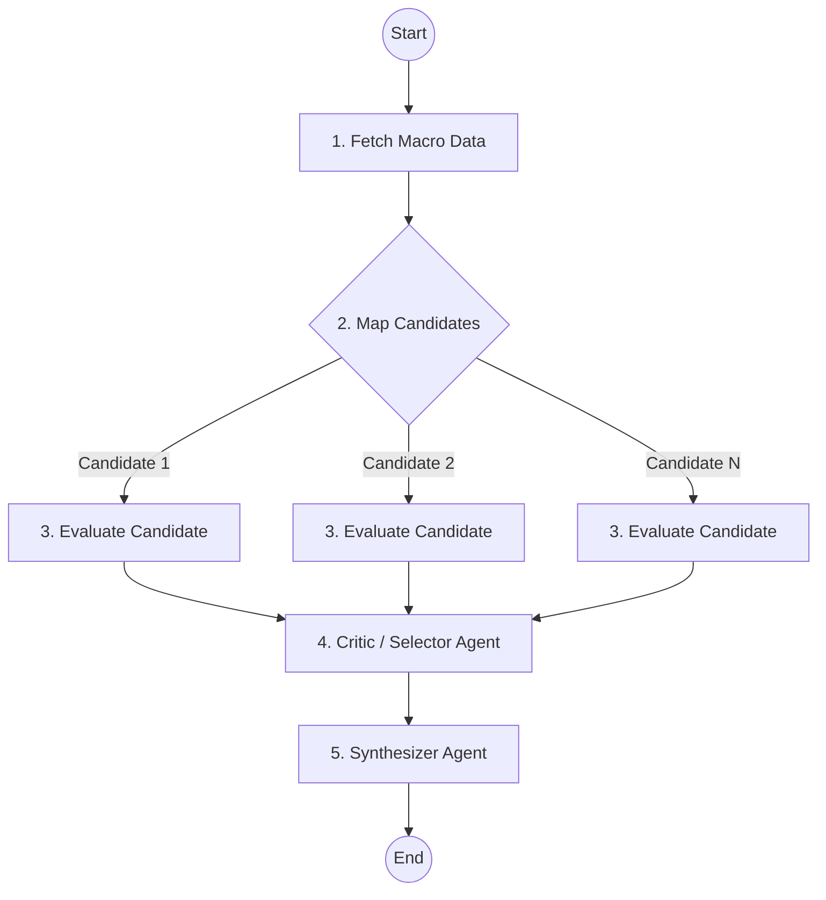

# Gemini-Powered Positional Trading Bot

A nightly batch system that behaves like a disciplined equity analyst for the Indian Stock Market (NSE/BSE). It scans the universe after market close, identifies positional trade setups (Minervini/O'Neil style), reviews open positions, and produces a structured research memo with actionable decisions using Gemini.

## Project Structure

For detailed technical architecture, data flow pipeline, and folder structure, please see the [ARCHITECTURE.md](file:///Users/manitgupta/experiments/ai-positional-trader/ARCHITECTURE.md) file.

## Setup & Execution

For detailed instructions on how to:
- Set up the environment and database
- Configure credentials and Telegram
- Run the bot manually or scheduled

Please refer to the [SETUP.md](file:///Users/manitgupta/experiments/ai-positional-trader/SETUP.md) file.

## The Stock Selection Process (Methodology)

Every night, the bot follows a disciplined multi-phase process to identify high-conviction setups, moving from hard data filtering to a sophisticated multi-agent AI analysis.

### Phase 1: Data Foundation
- **Universe**: The bot scans a universe of ~2,300 common stocks (Series 'EQ').
- **Daily Prices**: Fetches daily OHLCV data to compute technical indicators.
- **Weekly Prices**: Fetches weekly data to confirm long-term Stage-2 uptrends.

### Phase 2: Hard Filters & Ranking

To narrow down the massive universe to actionable candidates, the bot applies strict **Hard Filters** in DuckDB SQL, followed by a **Composite Scoring** system:

#### Hard Filters Criteria:
1. **Liquidity Filter**: Ensures the stock is tradable and liquid.
   - `Series = 'EQ'` (Common Equity only)
   - `Price >= ₹50`
   - `50-Day Average Turnover >= ₹10 Crore`
2. **Trend Liveness Filter**: Catches stocks showing signs of life or active Stage-2 trends.
   - `Price within 50% of 52-Week High` OR
   - `50-DMA > 200-DMA` OR
   - `Current Price > Price 3 Months Ago`

Stocks passing these filters (typically ~800) are then ranked using a **Composite Score**:
- **Weighted RS (35%)**: IBD-style weighted returns (40% to 3m, 20% each to 6m, 9m, 12m).
- **Proximity to High (25%)**: Favors stocks trading near 52-week highs.
- **Base Tightness (25%)**: Favors low-volatility consolidations (inverse of ATR/Close).
- **Sector RS (15%)**: Favors stocks in leading sectors.

The top **30 candidates** from this ranking proceed to the next phase.

### Phase 3: Data Enrichment
- Fetches fresh **Quarterly Fundamentals** and **News** from Screener.in *only* for the top 30 candidates to avoid rate limits.

### Phase 4: Multi-Agent AI Analysis (LangGraph)

The bot employs a multi-agent flow designed with **LangGraph** to ensure the highest accuracy and conviction for each selected candidate.

#### The Agents:
1. **Fetch Macro Data Node**: Fetches global macro context (Nifty, VIX, etc.) once to share across all evaluators.
2. **Candidate Evaluators (Parallel)**: One Gemini call per candidate. Acts as a SEPA analyst using tools (price history, fundamentals, news) to deep-dive on the specific stock and generate a structured evaluation.
3. **Critic / Selector Agent**: A strict "portfolio manager" agent that reviews all evaluations, challenges weak theses, and selects only the best candidates (Conviction >= 8 for Buy Setups, 6-8 for Watchlist).
4. **Synthesizer Agent**: Takes the filtered selections and writes the final nightly research memo with structured decisions.

### Code 33 Earnings Acceleration
The system detects Mark Minervini's "Code 33" pattern (3 consecutive quarters of accelerating YoY growth in EPS and Sales) and exposes this flag to Gemini to help it identify elite fundamental momentum.

## How to Use the Bot (Trading Strategy)

The bot is designed to be a nightly advisor. It does not execute trades automatically. Here is how you should use its output:

1. **Review the Daily Telegram Message**: Every day after market close, read the summary message sent to your Telegram.
2. **Focus on "Buy Setups"**: These are stocks in a low-risk entry position. 
   * **DO NOT buy them immediately** at the market open.
   * Set an alert in your trading terminal (e.g., Zerodha, Groww) for the specific **Entry Trigger** price provided by the bot.
   * Only take the trade if the stock crosses the trigger price on strong volume during market hours.
3. **Use the Watchlist**: These are great stocks that are currently too extended or need more time to consolidate. Add them to your broker's watchlist and wait for them to form a proper base. They may graduate to "Buy Setups" in future runs.
4. **Respect Risk Management**: Always set the **Stop Loss** provided by the bot to protect your capital.

